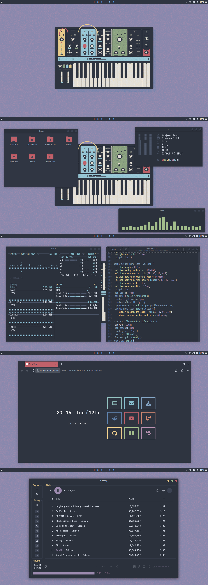
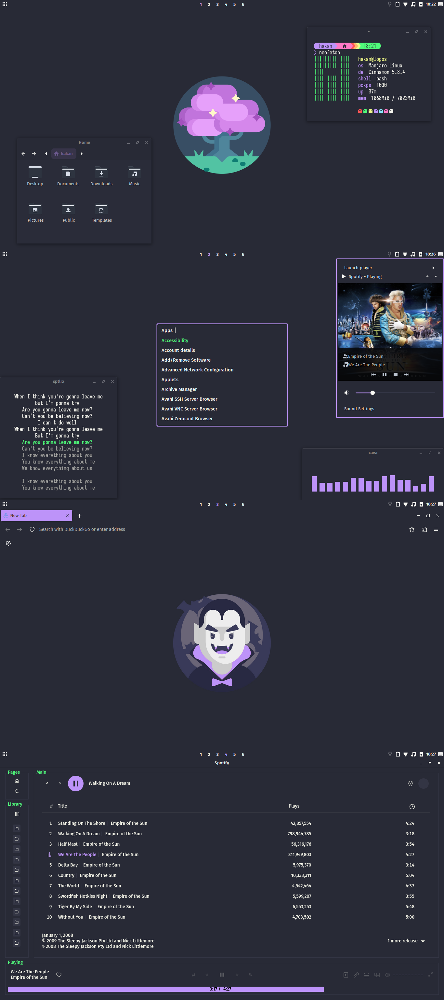

# Cinnamon Themes

## Nord Colours Everywhere

 

 

## Minimalist Dracula

 

 

## Apps and Sources:
- Themes: [Nordic](https://www.pling.com/s/Cinnamon/p/1267246), [Dracula](https://www.pling.com/s/Cinnamon/p/1687249)
- Icons: [Papirus Nord](https://github.com/Adapta-Projects/Papirus-Nord), [Papirus Folders](https://github.com/PapirusDevelopmentTeam/papirus-folders)
- App launcher: [Rofi](https://github.com/davatorium/rofi)
- Spotify: [Spicetify](https://github.com/spicetify)
- gedit: [Nord gedit](https://github.com/arcticicestudio/nord-gedit), [Dracula gedit](https://github.com/dracula/gedit)
- Terminal: [Kitty](https://github.com/kovidgoyal/kitty)
- Shell prompt: [Starship](https://starship.rs/)
- Resource monitor: [Btop++](https://github.com/aristocratos/btop)
- Document Viewer: [Zathura](https://github.com/pwmt/zathura)
- Audio Visualizer: [cava](https://github.com/karlstav/cava)
- Lyrics: [sptlrx](https://github.com/raitonoberu/sptlrx)
- Fonts: [Fira](https://github.com/mozilla/Fira), [Iosevka](https://github.com/be5invis/Iosevka), [Iosevka Nerd Font](https://github.com/ryanoasis/nerd-fonts)
- Wallpapers: [Dracula](https://github.com/aynp/dracula-wallpapers)
